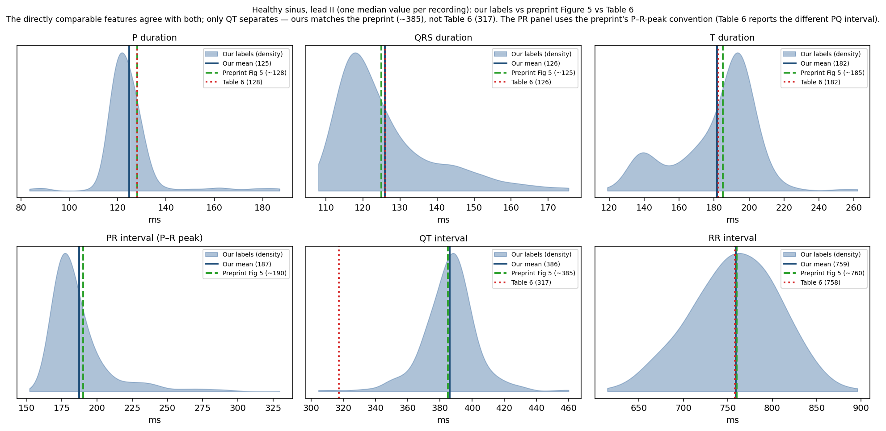

# statistics — STEP 3: population validation vs the preprint & Table 6

Two-level population statistics for the MedalCare-XL ECGdeli labels, compared against the
**preprint** (arXiv:2211.15997) Figure 5 and the **published** Table 6.

Layout: `scripts/` (builders), `data/` (the CSVs below), `figures/` (the PNGs below). Scripts read
the fixed fiducials from `../ecgdeli_labelling/data/primary/` and resolve paths via the repo root.

## Method (two levels)

**Level 1 — per signal, per lead (`per_signal_median.csv`).** Each recording is a 10 s ECG built
from ~13 beats (repeated P/QRS template with RR variability and per-beat stretching/shrinking of
the QRSoff–Toff segment). For each recording and lead we collapse those beats to **one median
value per interval** (QT, QRS duration, T duration, PQ, PR, RR, plus QT-to-peak). 202,176 rows
(16,848 recordings × 12 leads). The median is on the intervals (not absolute sample positions)
and resists the occasional mis-detected beat.

**Level 2 — per lead, per class (`per_lead_class_summary.csv`).** The Level-1 medians are then
aggregated across recordings into mean, SD and n, for each lead and each disease class. This is
the unit that lines up with the paper: Figure 5 (lead II density over all ECGs), Table 6
(per-lead mean ± SD, all 12 leads), and Figure 6 (per class, per relevant lead).

## Result (healthy sinus)

Every timing biomarker reproduces the paper **except QT**, and QT matches the **preprint**:

| Feature (lead II) | Ours | Preprint Fig 5 (est.) | Table 6 |
|---|---|---|---|
| P duration | 125 | ~128 | 128 |
| QRS duration | 126 | ~125 | 126 |
| T duration | 182 | ~185 | 182 |
| PR interval | 187 | ~190 | — |
| **QT interval** | **386** | **~385** | **317** |
| RR interval | 759 | ~760 | 758 |

Across all 12 leads (`comparison_sinus_vs_table6.csv`): QRS duration, T duration and RR match
Table 6 to within a few ms; P duration and PQ run slightly short (the simulated beats carry only
a residual P wave); and **QT is +66 to +74 ms vs Table 6 in every lead** — the known T-offset
localisation difference. The same QT sits right on the preprint Figure 5 peak (~385 ms).

In the QT panel the preprint line (green) lands on our distribution's peak while Table 6 (red)
falls outside it; for every other feature the three overlap.

## Amplitudes (sinus, lead II — Figure 5 amplitude panels)

Amplitude = signal at the fiducial peak minus the pre-QRS baseline, per-signal median then cohort
mean over a reproducible random sample of 200 recordings, seed 2026 (`amplitudes_sinus_leadII.csv`):

| Feature | Ours (mV) | Table 6 | Preprint Fig 5 (est.) |
|---|---|---|---|
| P amplitude | 0.07 | 0.09 | ~0.10 |
| Q amplitude | 0.052 | 0.06 | ~0.05 |
| R amplitude | 0.541 | 0.59 | ~0.70 |
| S amplitude | −0.197 | −0.20 | ~−0.20 |
| T amplitude | 0.468 | 0.49 | ~0.45 |

S and T amplitudes match both references; R sits close to Table 6 (0.54 vs 0.59) and below the
preprint's ~0.70; the P wave runs slightly low while Q now agrees closely with Table 6, consistent
with the residual P wave of the simulated beats.

## Per-class timing (Figure 6)

For the timing features Figure 6 highlights per disease, our healthy-vs-disease shifts all go the
expected direction (`fig6_timing_by_class.csv`):

| Class | Feature (lead) | Healthy | Disease | Shift | Fig 6 |
|---|---|---|---|---|---|
| RBBB | QRSdur (II) | 125.9 | 131.2 | +5.3 | wider QRS ✓ |
| LBBB | QRSdur (II) | 125.9 | 137.8 | +11.9 | wider QRS ✓ |
| AV block | PR (II) | 187.4 | 280.8 | +93.5 | prolonged PR ✓ |
| IAB | Pdur (II) | 124.8 | 132.5 | +7.7 | wider P ✓ |
| LAE | Pdur (II) | 124.8 | 135.5 | +10.7 | wider P ✓ |
| FAM | Pdur (V6) | 119.8 | 124.1 | +4.2 | wider/abnormal P ✓ |
| MI | QT (V4) | 363.3 | 375.3 | +12.0 | prolonged QT ✓ |

### Figure 6 amplitude panels (healthy vs disease)

The amplitude features Figure 6 highlights per disease (`fig6_amplitudes_by_class.csv`), computed
as signal-at-peak minus pre-QRS baseline, per-signal median then cohort mean over a reproducible random sample of 100 recordings per class (seed 2026):

| Feature (lead) | Class | Healthy (mV) | Disease (mV) | Shift |
|---|---|---|---|---|
| Q amplitude (II) | MI | 0.046 | 0.133 | +0.087 |
| R amplitude (V2) | MI | −1.494 | −2.076 | −0.582 |
| R amplitude (II) | LAE | 0.549 | 0.496 | −0.053 |
| P amplitude (aVL) | FAM | 0.035 | 0.014 | −0.021 |
| P amplitude (V6) | FAM | 0.084 | 0.049 | −0.035 |

MI alters the Q (lead II) and R (V2) amplitudes, and FAM reduces the P-wave amplitude (aVL, V6) —
both consistent with Figure 6. LAE leaves the R amplitude little changed (its signature is in the P
wave, not R). The V2 R amplitude is negative because V2 carries a predominantly negative
(rS/QS) QRS in these simulated signals, so the labelled R sits below baseline.

## Files

`scripts/`
- `build_per_signal_stats.py` — builds Level 1 + Level 2 + the Table-6 timing comparison.
- `build_comparison_figure.py` — builds the lead-II timing figure.
- `build_amplitudes_fig5.py` — sinus lead-II amplitudes (Figure 5 amplitude panels).
- `build_fig6_timing.py` — per-class timing shifts (Figure 6).
- `build_fig6_amp_positions.py` / `build_fig6_amplitudes.py` — per-class amplitude panels (Figure 6).
- `build_apd_vs_qt.py` — APD-vs-QT relationship (diagnostic).
- `score_vs_table6.py`, `reproduce_paper_stats.py` / `.m` — scoring / full reproduction utilities.

`data/`
- `per_signal_median.csv` — Level 1 (per recording × lead medians).
- `per_lead_class_summary.csv` — Level 2 (per lead × class mean/SD/n, all 8 classes).
- `comparison_sinus_vs_table6.csv` — sinus per-lead means vs Table 6.
- `amplitudes_sinus_leadII.csv` — sinus lead-II amplitudes vs Table 6 / preprint.
- `fig6_timing_by_class.csv` / `fig6_amplitudes_by_class.csv` — per-class shifts vs Figure 6.
- `apd_by_run.csv` — action-potential-duration per run (diagnostic).

`figures/`
- `leadII_vs_paper_preprint.png` — the figure above.
- `apd_vs_qt.png` — APD-vs-QT scatter (diagnostic).

Preprint Figure 5/6 values are estimated by eye from the density peaks (the preprint has no raw
table). The comparison now covers all of Figure 5 (timing + amplitude, lead II) and Figure 6
(per-class timing + amplitude).
